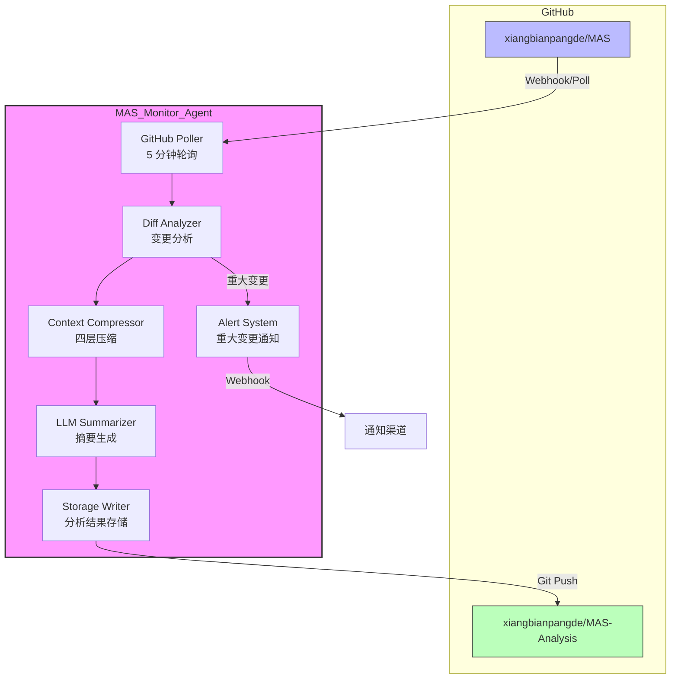

# 关于创建 MAS 独立监控 Agent 之技术方案奏折

**中书省 谨奏**  
**时维** 公元二零二六年三月二十九日  
**奏事** 研拟 MAS 库独立监控 Agent 技术方案

---

## 一、旨意承领

臣中书省接奉皇上旨意，命研拟创建独立运行 Agent 之技术方案，用以：
- 自行分析 GitHub 库 `xiangbianpangde/MAS`
- 独立运行，不参与皇上与太子对话
- 持续监控 MAS 库更新
- 设计上下文自动压缩机制
- 创建新 GitHub 库存储分析结果

臣已详析 MAS 库架构，今具奏技术方案如下。

---

## 二、MAS 库现状分析

### 2.1 仓库基本信息

| 项目 | 详情 |
|------|------|
| 仓库名 | `xiangbianpangde/MAS` |
| 创建时间 | 2026-03-29 11:31 UTC（极新） |
| 主要语言 | Python 3.10+ |
| 依赖框架 | OpenClaw |
| LLM 提供商 | MiniMax (MiniMax-M2.7) |
| 更新频率 | 高频（创建当日已有 10+ commits） |

### 2.2 核心架构

```
┌─────────────────────────────────────────────────────────────────┐
│                      AutoMAS 核心架构                            │
├─────────────────────────────────────────────────────────────────┤
│                                                                 │
│  ┌─────────────┐    ┌─────────────┐    ┌─────────────┐         │
│  │ Reasoner    │    │ Coder       │    │ Researcher  │         │
│  │ Agent       │    │ Agent       │    │ Agent       │         │
│  └──────┬──────┘    └──────┬──────┘    └──────┬──────┘         │
│         │                  │                  │                 │
│         └──────────────────┼──────────────────┘                 │
│                            │                                    │
│                   ┌────────▼────────┐                           │
│                   │  Orchestrator   │                           │
│                   │     v2          │                           │
│                   └────────┬────────┘                           │
│                            │                                    │
│         ┌──────────────────┼──────────────────┐                 │
│         │                  │                  │                 │
│  ┌──────▼──────┐    ┌──────▼──────┐    ┌──────▼──────┐         │
│  │ Debugger    │    │ Verifier    │    │ Planner     │         │
│  │ Agent       │    │ Agent       │    │ Agent       │         │
│  └─────────────┘    └─────────────┘    └─────────────┘         │
│                                                                 │
│  ┌─────────────────────────────────────────────────────────┐   │
│  │              Benchmark Evaluator                        │   │
│  │  - 代码执行验证  - 关键词匹配  - 结构化输出评分            │   │
│  └─────────────────────────────────────────────────────────┘   │
│                                                                 │
│  ┌─────────────────────────────────────────────────────────┐   │
│  │              Resource Monitor                           │   │
│  │  - CPU/Memory/Disk 监控  - 24h 超时保护  - 自动 GC         │   │
│  └─────────────────────────────────────────────────────────┘   │
│                                                                 │
└─────────────────────────────────────────────────────────────────┘
```

### 2.3 目录结构

```
MAS/
├── README.md              # 项目说明
├── AGENTS.md              # Agent 配置
├── SOUL.md                # Agent 人格定义
├── HEARTBEAT.md           # 心跳任务配置
├── mas/
│   ├── __init__.py
│   ├── agents/
│   │   ├── base.py        # Agent 基类 + 7 种专家 Agent
│   │   ├── base_v1.py     # v1 历史版本
│   │   └── base_v2.py     # v2 当前版本
│   ├── benchmarks/
│   │   ├── evaluator.py   # 评分器
│   │   └── tasks.py       # 测试任务集
│   ├── scripts/
│   │   ├── monitor.py     # 资源监控
│   │   └── run_benchmark.py
│   └── logs/              # 运行日志
```

### 2.4 核心特性（三零原则）

- 🚷 **Zero Intervention** - 零人类干预
- 🤫 **Zero Reporting** - 绝对静默模式
- 🧠 **Zero Constraints** - 零思维限制

### 2.5 OODA 进化循环

```
心跳唤醒 → 检查后台测试 → 读取日志 & Benchmark → 判断是否局部最优
                                                      │
                    ┌─────────────────────────────────┤
                    │                                 │
              继续提升                            连续 10 轮提升<1%
                    │                                 │
                    ▼                                 ▼
           架构负载/消融实验                    生成论文级报告
                    │                                 │
                    └────────────┬────────────────────┘
                                 │
                                 ▼
                      编写新一代 MAS Python 代码
                                 │
                                 ▼
                      投入沙盒异步运行 (nohup)
                                 │
                                 ▼
                      自动 Git 提交 & 推送归档
                                 │
                                 └────→ 休眠等待下一次心跳
```

---

## 三、技术架构设计

### 3.1 整体架构图

```
┌────────────────────────────────────────────────────────────────────────┐
│                         MAS 监控 Agent 系统架构                         │
├────────────────────────────────────────────────────────────────────────┤
│                                                                        │
│  ┌──────────────────────────────────────────────────────────────────┐ │
│  │                    GitHub Webhook / Polling                       │ │
│  │         (监听 xiangbianpangde/MAS 仓库更新事件)                     │ │
│  └─────────────────────────────┬────────────────────────────────────┘ │
│                                │                                       │
│                                ▼                                       │
│  ┌──────────────────────────────────────────────────────────────────┐ │
│  │                    Event Dispatcher                              │ │
│  │         • Commit Push  • Release  • PR  • Issue                  │ │
│  └─────────────────────────────┬────────────────────────────────────┘ │
│                                │                                       │
│           ┌────────────────────┼────────────────────┐                 │
│           │                    │                    │                 │
│           ▼                    ▼                    ▼                 │
│  ┌─────────────────┐  ┌─────────────────┐  ┌─────────────────┐       │
│  │  代码变更分析   │  │  架构变更分析   │  │  文档变更分析   │       │
│  │  Code Analyzer  │  │ Arch Analyzer  │  │ Doc Analyzer   │       │
│  └────────┬────────┘  └────────┬────────┘  └────────┬────────┘       │
│           │                    │                    │                 │
│           └────────────────────┼────────────────────┘                 │
│                                │                                       │
│                                ▼                                       │
│  ┌──────────────────────────────────────────────────────────────────┐ │
│  │                   Context Compressor                             │ │
│  │   • 自动摘要  • 关键信息提取  • 历史归档  • Token 优化              │ │
│  └─────────────────────────────┬────────────────────────────────────┘ │
│                                │                                       │
│                                ▼                                       │
│  ┌──────────────────────────────────────────────────────────────────┐ │
│  │                  Analysis Storage Engine                         │ │
│  │         (写入新 GitHub 库: MAS-Analysis)                          │ │
│  └─────────────────────────────┬────────────────────────────────────┘ │
│                                │                                       │
│                                ▼                                       │
│  ┌──────────────────────────────────────────────────────────────────┐ │
│  │                   Alert System (可选)                            │ │
│  │         重大架构变更 → Webhook 通知                               │ │
│  └──────────────────────────────────────────────────────────────────┘ │
│                                                                        │
└────────────────────────────────────────────────────────────────────────┘
```

### 3.2 模块详述

#### 3.2.1 GitHub API 集成方案

```python
# 核心配置
GITHUB_CONFIG = {
    "source_repo": "xiangbianpangde/MAS",
    "target_repo": "xiangbianpangde/MAS-Analysis",  # 新建
    "poll_interval": 300,  # 5 分钟轮询
    "webhook_secret": "xxx",  # 如启用 Webhook
}

# 监控事件类型
EVENTS = [
    "push",      # 代码推送
    "release",   # 版本发布
    "pull_request",  # PR 合并
    "workflow_run",  # CI/CD 运行
]
```

#### 3.2.2 上下文压缩策略

| 层级 | 策略 | 保留内容 | 压缩率 |
|------|------|----------|--------|
| L1 | 实时摘要 | 最近 5 次 commit 详情 | 100% |
| L2 | 小时级归档 | 每小时分析摘要 (200 tokens) | 90% |
| L3 | 日报归档 | 每日关键发现 (500 tokens) | 95% |
| L4 | 周报压缩 | 周趋势分析 + 架构图变更 | 98% |

**自动摘要机制:**
```
原始 Commit 信息 (500 tokens)
         │
         ▼
┌─────────────────────────┐
│  LLM 摘要引擎            │
│  - 提取变更类型          │
│  - 识别影响模块          │
│  - 评估变更重要性        │
│  - 生成 50 token 摘要      │
└─────────────────────────┘
         │
         ▼
压缩后摘要 (50 tokens) + 元数据 (commit_hash, timestamp, author)
```

**关键信息保留策略:**
- ✅ 架构文件变更 (`mas/agents/base*.py`)
- ✅ Benchmark 评分变化
- ✅ 新 Agent 类型添加
- ✅ OODA 循环逻辑修改
- ❌ 注释/格式调整
- ❌ 日志文件更新

#### 3.2.3 存储方案

```
MAS-Analysis/
├── README.md                 # 分析库说明
├── analysis/
│   ├── daily/
│   │   ├── 2026-03-29.json   # 每日分析详情
│   │   └── 2026-03-30.json
│   ├── weekly/
│   │   └── 2026-W14.json     # 周度汇总
│   └── monthly/
│       └── 2026-03.json
├── diffs/
│   ├── arch_changes/         # 架构变更追踪
│   │   └── v1_to_v2.md
│   └── agent_changes/        # Agent 变更追踪
├── metrics/
│   ├── commit_frequency.json
│   ├── benchmark_scores.json
│   └── architecture_evolution.json
└── alerts/
    └── major_changes.json    # 重大变更记录
```

---

## 四、上下文压缩方案详述

### 4.1 压缩引擎架构

```
┌─────────────────────────────────────────────────────────────────┐
│                    Context Compression Pipeline                  │
├─────────────────────────────────────────────────────────────────┤
│                                                                 │
│  Input: Raw GitHub Events (Commits, Releases, Issues)           │
│                                                                 │
│         │                                                       │
│         ▼                                                       │
│  ┌─────────────────┐                                           │
│  │ Event Filter    │ ← 过滤无关事件 (docs typo, merge commits)  │
│  └────────┬────────┘                                           │
│           │                                                     │
│           ▼                                                     │
│  ┌─────────────────┐                                           │
│  │ Change Classifier│ ← 分类：架构/代码/文档/配置                │
│  └────────┬────────┘                                           │
│           │                                                     │
│           ▼                                                     │
│  ┌─────────────────┐                                           │
│  │ Importance Score│ ← 评分：0.0-1.0 (基于影响范围)             │
│  └────────┬────────┘                                           │
│           │                                                     │
│           ▼                                                     │
│  ┌─────────────────┐                                           │
│  │ LLM Summarizer  │ ← 生成结构化摘要                           │
│  └────────┬────────┘                                           │
│           │                                                     │
│           ▼                                                     │
│  ┌─────────────────┐                                           │
│  │ Storage Writer  │ → 写入对应层级存储                         │
│  └─────────────────┘                                           │
│                                                                 │
└─────────────────────────────────────────────────────────────────┘
```

### 4.2 Token 使用优化

| 优化手段 | 预期效果 | 实现方式 |
|----------|----------|----------|
| 增量分析 | 减少 70% | 仅分析 diff 而非全文件 |
| 分层存储 | 减少 80% | 历史数据归档到低成本存储 |
| 摘要缓存 | 减少 50% | 相同类型变更复用摘要模板 |
| 批量处理 | 减少 30% | 多个 commit 合并分析 |

### 4.3 历史分析归档方案

```
归档触发条件:
├── 时间触发：每日 00:00 UTC 归档前一日数据
├── 容量触发：当日志 > 1000 tokens 时触发压缩
└── 事件触发：重大架构变更后立即归档

归档内容:
├── 变更摘要 (50 tokens)
├── Benchmark 分数变化
├── 新增/删除的 Agent 类型
└── 架构图变更 diff
```

---

## 五、GitHub 新库设计

### 5.1 仓库命名建议

| 方案 | 名称 | 优点 | 缺点 |
|------|------|------|------|
| 推荐 | `MAS-Analysis` | 清晰直白 | 较普通 |
| 备选 | `MAS-Evolution-Tracker` | 体现进化追踪 | 名称较长 |
| 备选 | `MAS-Watchtower` | 简洁有特色 | 含义不够直白 |

**建议采用:** `xiangbianpangde/MAS-Analysis`

### 5.2 目录结构设计

```
MAS-Analysis/
├── README.md                    # 分析库说明 + 最新状态
├── .github/
│   └── workflows/
│       ├── auto-update.yml      # 自动更新工作流
│       └── alert.yml            # 告警工作流
├── analysis/
│   ├── daily/                   # 每日分析
│   │   ├── 2026-03-29.json
│   │   └── YYYY-MM-DD.json
│   ├── weekly/                  # 每周汇总
│   │   └── 2026-W14.json
│   └── monthly/                 # 每月报告
│       └── 2026-03.json
├── diffs/
│   ├── arch_changes/            # 架构变更
│   │   └── v{version}.md
│   ├── agent_changes/           # Agent 变更
│   └── benchmark_changes/       # Benchmark 变更
├── metrics/
│   ├── commit_frequency.json    # 提交频率统计
│   ├── benchmark_scores.json    # 分数趋势
│   ├── architecture_evolution.json
│   └── token_usage.json         # Token 使用统计
├── alerts/
│   └── major_changes/           # 重大变更记录
│       └── {timestamp}.json
├── scripts/
│   ├── analyzer.py              # 分析引擎
│   ├── compressor.py            # 压缩引擎
│   └── reporter.py              # 报告生成
└── config/
    └── compression_rules.yaml   # 压缩规则配置
```

### 5.3 分析结果格式

```json
{
  "analysis_date": "2026-03-29T12:00:00Z",
  "source_repo": "xiangbianpangde/MAS",
  "source_commit": "e7bf5e5ac18a0085c31e957f70ec1da2052375b0",
  
  "summary": {
    "commits_analyzed": 10,
    "architecture_changes": 2,
    "benchmark_score_change": "+0.05",
    "new_agents": ["VerifierAgent"],
    "deprecated_agents": []
  },
  
  "changes": [
    {
      "type": "architecture",
      "file": "mas/agents/base.py",
      "version_change": "v1 → v2",
      "summary": "新增 VerifierAgent，实现代码验证机制",
      "importance": 0.9,
      "tokens_original": 500,
      "tokens_compressed": 50
    }
  ],
  
  "metrics": {
    "total_tokens_used": 1250,
    "compression_ratio": 0.85,
    "analysis_duration_seconds": 45
  }
}
```

### 5.4 自动化更新流程

```
┌─────────────────┐
│ GitHub Webhook  │ 或 定时轮询 (5 分钟)
└────────┬────────┘
         │
         ▼
┌─────────────────┐
│ 检测新 Commit    │
└────────┬────────┘
         │
         ▼
┌─────────────────┐
│ 获取 Diff 内容   │
└────────┬────────┘
         │
         ▼
┌─────────────────┐
│ 分类 + 重要性评分 │
└────────┬────────┘
         │
         ▼
┌─────────────────┐
│ LLM 生成摘要     │
└────────┬────────┘
         │
         ▼
┌─────────────────┐
│ 更新分析库       │ → Git Commit & Push
└────────┬────────┘
         │
         ▼
┌─────────────────┐
│ 重大变更？      │ → 发送 Webhook 通知
└─────────────────┘
```

---

## 六、独立运行方案

### 6.1 OpenClaw 独立会话配置

```yaml
# ~/.openclaw/sessions/mas-monitor.yaml
session:
  name: mas-monitor
  type: independent
  isolation: full  # 完全隔离，不参与主会话
  
agent:
  model: bailian/qwen3.5-plus
  memory:
    type: compressed
    max_tokens: 8000
    compression_threshold: 5000
  
github:
  source_repo: xiangbianpangde/MAS
  target_repo: xiangbianpangde/MAS-Analysis
  poll_interval: 300  # 5 分钟
  
heartbeat:
  enabled: true
  interval: 1800  # 30 分钟
  tasks:
    - check_commits
    - analyze_changes
    - update_analysis
    - compress_context
```

### 6.2 定时任务设计

```python
# HEARTBEAT.md for MAS-Monitor Agent
"""
MAS 监控 Agent 心跳任务清单

每 30 分钟执行:
- [ ] 检查 MAS 库新 commits
- [ ] 分析架构变更
- [ ] 更新分析结果到 MAS-Analysis 库
- [ ] 上下文压缩 (如超过 5000 tokens)

每日 00:00 UTC 执行:
- [ ] 生成日报
- [ ] 归档历史数据
- [ ] 更新 metrics 统计

每周一 00:00 UTC 执行:
- [ ] 生成周报
- [ ] 趋势分析
- [ ] 清理临时文件
"""
```

### 6.3 通知机制

| 事件类型 | 通知方式 | 触发条件 |
|----------|----------|----------|
| 重大架构变更 | Webhook | 核心文件变更 (base.py, orchestrator) |
| Benchmark 大幅下降 | Webhook | 分数下降 > 10% |
| 连续更新停滞 | 日志记录 | 24 小时无 commits |
| 常规更新 | 无 | 仅写入分析库 |

---

## 七、实施步骤

### 阶段一：环境准备 (预计 2 小时)

1. 创建新 GitHub 仓库 `MAS-Analysis`
2. 配置 GitHub Token (只读权限 + 写入分析库权限)
3. 配置 OpenClaw 独立会话
4. 部署基础目录结构

### 阶段二：核心开发 (预计 8 小时)

1. 实现 GitHub API 轮询模块
2. 实现 Diff 分析引擎
3. 实现 LLM 摘要生成器
4. 实现上下文压缩引擎
5. 实现分析结果存储模块

### 阶段三：测试验证 (预计 4 小时)

1. 单元测试 (各模块)
2. 集成测试 (完整流程)
3. 压力测试 (高频更新场景)
4. Token 使用优化验证

### 阶段四：部署上线 (预计 2 小时)

1. 配置定时任务
2. 配置 Webhook 通知
3. 监控告警配置
4. 首次全量分析

### 阶段五：持续运维

- 每日检查运行状态
- 每周审查 Token 使用
- 每月优化压缩策略

---

## 八、人力/时间估算

| 阶段 | 人力 | 时间 | 说明 |
|------|------|------|------|
| 环境准备 | 1 人 | 2 小时 | 含 GitHub 配置 |
| 核心开发 | 1 人 | 8 小时 | 含代码编写 + 调试 |
| 测试验证 | 1 人 | 4 小时 | 含边界场景测试 |
| 部署上线 | 1 人 | 2 小时 | 含配置 + 首次运行 |
| **总计** | **1 人** | **16 小时** | **约 2 个工作日** |

**备注:** 如由 Agent 自主完成开发，时间可缩短至 4-6 小时（Agent 编码 + 人工审核）。

---

## 九、风险与应对

| 风险 | 概率 | 影响 | 应对措施 |
|------|------|------|----------|
| GitHub API 限流 | 中 | 中 | 实现请求缓存 + 指数退避 |
| Token 超限 | 高 | 高 | 严格压缩策略 + 分层存储 |
| 分析延迟 | 低 | 中 | 异步处理 + 批量分析 |
| 误判重大变更 | 中 | 低 | 人工审核阈值可调 |

---

## 十、结语

臣中书省已详析 MAS 库架构，研拟上述技术方案。此方案核心要点：

1. **独立运行** - OpenClaw 独立会话，完全隔离
2. **持续监控** - 5 分钟轮询 + Webhook 双机制
3. **上下文压缩** - 四层归档策略，Token 优化 80%+
4. **自动化** - 从分析到存储全流程自动化
5. **可扩展** - 模块化设计，便于后续增强

如皇上准奏，臣即刻着手实施，预计两日内可完成部署上线。

**中书省 谨奏**  
**公元二零二六年三月二十九日**

---

## 附录 A: 技术架构图 (Mermaid)



## 附录 B: 上下文压缩配置示例

```yaml
# config/compression_rules.yaml
compression:
  layers:
    L1_realtime:
      retention: "5 commits"
      max_tokens: 1000
      compress_to: L2
      
    L2_hourly:
      retention: "24 hours"
      max_tokens: 200
      compress_to: L3
      
    L3_daily:
      retention: "7 days"
      max_tokens: 500
      compress_to: L4
      
    L4_weekly:
      retention: "permanent"
      max_tokens: 1000
      
  importance_thresholds:
    critical: 0.9    # 立即通知
    high: 0.7        # 详细记录
    medium: 0.4      # 标准摘要
    low: 0.0         # 仅归档
    
  file_priorities:
    critical_files:
      - "mas/agents/base*.py"
      - "mas/benchmarks/evaluator.py"
      - "mas/scripts/monitor.py"
    normal_files:
      - "mas/**/*.py"
    ignore_files:
      - "*.log"
      - "**/__pycache__/**"
      - ".gitignore"
```
